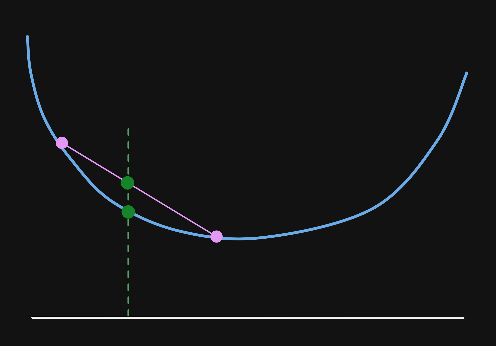

\pagebreak
\tableofcontents
\pagebreak

# Convex Optimization I

## Introduction

### Least squares

How do we know a problem is least squares? Are we asked to minimize the two norm
squares of an affine function of $x$, i.e. $f(x) = ax+b$? Then yes, else no...

### Convex optimization

$$
\begin{gathered}
\text{minimize} \space f_0(x)
\\[1em]
\text{subject to} \space f_i(x) \le b_i, i = 1,...,m
\end{gathered}
$$

and all these functions have to be convex, i.e.

$$
\begin{gathered}
f_i(\alpha x+\beta y) \le \alpha f_i(x) + \beta f_i(y)
\\[1em]
\text{if } \space \alpha + \beta = 1, \space \alpha \ge 0 , \space \beta \ge 0
\end{gathered}
$$

the case of linear programming can be seen as an extreme case of convex
optimization where

$$
f_i(\alpha x+\beta y) = \alpha f_i(x) + \beta f_i(y)
$$

since any affine function is just at the limit of being either convex or concave.
